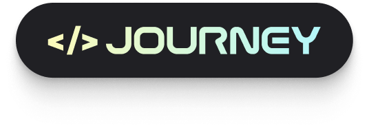
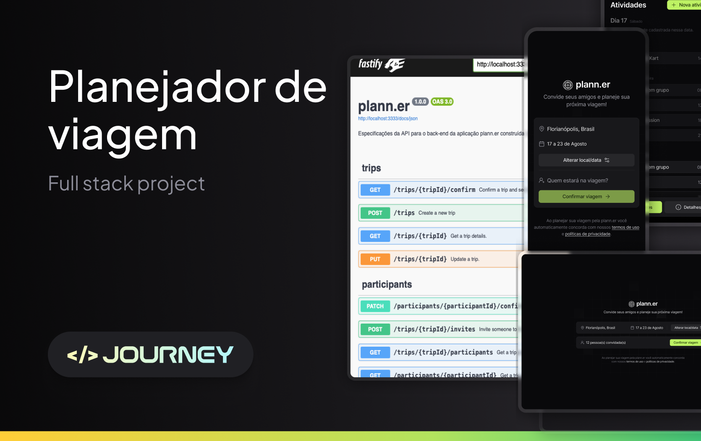

# NLW Journey
 

  

<h4 align="center"> 
  🚀 The <strong>Journey</strong> project on the <a href="https://lp.rocketseat.com.br/nlw">Next Level Week</a> by Rocketseat. 🚀
</h4>
 

  	
  
  
  
  

 

## Guide
 

  - [Description](#description)
  - [Stack and tools](#stack-and-tools)
  - [License](#license)
  - [Rocketseat Repo - backend](https://github.com/rocketseat-education/nlw-journey-nodejs)
  - [Rocketseat Repo - mobile](https://github.com/rocketseat-education/nlw-journey-react-native)
  - [Rocketseat Repo - web](https://github.com/rocketseat-education/nlw-journey-react)

 

## Description
 

 - The project is called *Plann.er*.
 - Next Level Week, also known as NLW, is a week where we develop an entire application. It is divided into two tracks, **"Explorer"** *(for those are new to programming)* and **"Ignite"** *(for those who already develop)*.
 - It is a travel planner application, where the user can input a location, start/end date and invite friends to his journey.

 

  

&nbsp;

## Stack and tools
 

#### Core

* [Typescript](https://www.typescriptlang.org)
* [Axios](https://axios-http.com/docs/intro)
* [Figma](https://www.figma.com/)

#### Front-end

* [React](https://reactjs.org/)
* [React Native](https://reactnative.dev/)
* [Expo](https://expo.dev/)
* [ViteJs](https://vitejs.dev)
* [Tailwind](https://tailwindcss.com/)
* [DayJs](https://day.js.org/docs/en/installation/typescript)
* [JWT](https://jwt.io)

#### Back-end

* [Node.js](https://nodejs.org/en/)
* [Prisma](https://www.prisma.io/)
* [Fastify](https://fastify.dev)
* [Nodemailer](https://nodemailer.com)
* [Zod](https://zod.dev)
* [OOP](https://developer.mozilla.org/en-US/docs/Learn/JavaScript/Objects/Object-oriented_programming)

&nbsp;

## License
 

This project is under the MIT license. See the [LICENSE](LICENSE) for details.
